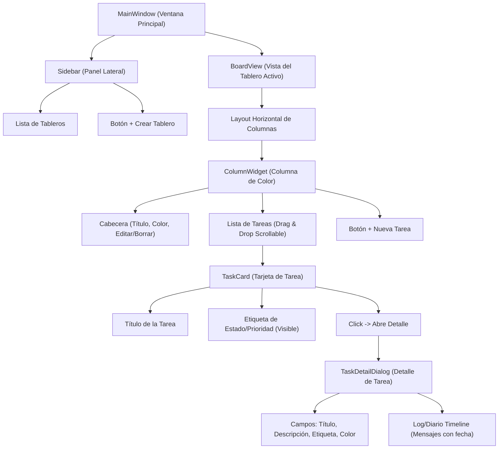

# Plan de Desarrollo: Ekin Kanban (Trello Lite)

Este plan detalla el diseño, la arquitectura y los pasos para construir un clon de Trello superligero y eficiente en recursos, utilizando **Python**, **PySide6** y **SQLite**. Está diseñado específicamente para uso personal, por lo que el "chat" de cada tarea servirá como un diario/log de actividades.

---

## 🚀 Arquitectura y Componentes

### 1. Almacenamiento de Datos (SQLite)
Usaremos **SQLite** integrado en Python (`sqlite3`). Esto garantiza:
* **Cero dependencias externas** (no requiere instalar servidores de bases de datos).
* **Consumo de memoria mínimo** y almacenamiento en un único archivo `.db`.
* **Rapidez extrema** en lecturas/escrituras.

#### Esquema de Base de Datos:
```sql
CREATE TABLE IF NOT EXISTS boards (
    id INTEGER PRIMARY KEY AUTOINCREMENT,
    name TEXT NOT NULL,
    created_at TIMESTAMP DEFAULT CURRENT_TIMESTAMP
);

CREATE TABLE IF NOT EXISTS columns (
    id INTEGER PRIMARY KEY AUTOINCREMENT,
    board_id INTEGER NOT NULL,
    name TEXT NOT NULL,
    color TEXT NOT NULL DEFAULT '#3b82f6', -- Color en formato HEX
    position INTEGER NOT NULL,
    FOREIGN KEY(board_id) REFERENCES boards(id) ON DELETE CASCADE
);

CREATE TABLE IF NOT EXISTS tasks (
    id INTEGER PRIMARY KEY AUTOINCREMENT,
    column_id INTEGER NOT NULL,
    title TEXT NOT NULL,
    description TEXT,
    tag_text TEXT,
    tag_color TEXT DEFAULT '#6b7280',
    position INTEGER NOT NULL,
    created_at TIMESTAMP DEFAULT CURRENT_TIMESTAMP,
    updated_at TIMESTAMP DEFAULT CURRENT_TIMESTAMP,
    FOREIGN KEY(column_id) REFERENCES columns(id) ON DELETE CASCADE
);

CREATE TABLE IF NOT EXISTS task_logs (
    id INTEGER PRIMARY KEY AUTOINCREMENT,
    task_id INTEGER NOT NULL,
    content TEXT NOT NULL,
    created_at TIMESTAMP DEFAULT CURRENT_TIMESTAMP,
    FOREIGN KEY(task_id) REFERENCES tasks(id) ON DELETE CASCADE
);
```

---

## 🎨 Diseño Visual y Experiencia de Usuario (QSS)
Para cumplir con los estándares de diseño premium y moderno, utilizaremos **Qt Style Sheets (QSS)** para darle un aspecto de aplicación moderna, tipo SaaS (al estilo Linear o Trello moderno):
* **Tema Oscuro Premium**: Paleta de colores basada en tonos pizarra oscuros (`#0f172a`, `#1e293b`), con acentos de color vibrantes para las columnas.
* **Tipografía**: Fuente del sistema limpia (Inter / Segoe UI) con jerarquías claras.
* **Componentes**: Bordes redondeados (`border-radius: 8px`), sombras sutiles, estados `:hover` y `:pressed` bien definidos con micro-animaciones en los botones.
* **Arrastrar y Soltar (Drag & Drop)**: Soporte nativo de PySide6 para mover tareas entre columnas de forma fluida.

---

## 🖥️ Estructura de la Interfaz (GUI)



### 1. Ventana Principal (`MainWindow`)
* **Barra Lateral Izquierda (Sidebar)**:
  * Lista de tableros con scroll.
  * Botón para añadir un nuevo tablero (abre un diálogo rápido).
  * Botón para eliminar el tablero seleccionado.
* **Área Central (`BoardView`)**:
  * Muestra el tablero actual con sus columnas distribuidas horizontalmente.
  * Si no hay tableros, muestra una pantalla de bienvenida limpia con instrucciones.
  * Botón en la parte derecha para añadir una nueva columna.

### 2. Columna (`ColumnWidget`)
* Cabecera con el nombre de la columna y una barra de color distintiva.
* Botón de menú o click derecho para editar el nombre de la columna, cambiar su color o eliminarla.
* Área con scroll para las tarjetas de tareas.
* Soporte nativo de Drag & Drop para aceptar tareas de otras columnas o reordenarlas.
* Botón "+ Añadir Tarea" en la parte inferior de la columna.

### 3. Tarjeta de Tarea (`TaskCard`)
* Un widget compacto con bordes redondeados.
* Título de la tarea.
* Si tiene etiqueta (`tag_text`), muestra una pequeña píldora coloreada (`tag_color`) en la esquina inferior.
* Cambia de estilo al pasar el cursor (hover) para dar feedback visual.
* Doble click o click para abrir la ventana de detalles.

### 4. Diálogo de Detalle (`TaskDetailDialog`)
* **Izquierda (Editor de Contenido)**:
  * Título editable.
  * Descripción editable usando un editor de texto multilínea enriquecido.
  * Selector de etiqueta (Texto de etiqueta y color).
* **Derecha (Chat / Log / Diario)**:
  * Historial de mensajes tipo chat, ordenados cronológicamente de arriba a abajo.
  * Cada mensaje muestra: Fecha/Hora y el contenido del log.
  * Caja de texto inferior para escribir nuevas entradas rápida y fácilmente pulsando `Enter` o el botón "Añadir al Diario".

---

## 🛠️ Plan de Implementación paso a paso

1. **Paso 1: Configuración del Entorno y Base de Datos (`database.py`)**
   * Crear la estructura de tablas SQLite.
   * Escribir funciones auxiliares de base de datos para realizar operaciones CRUD (Create, Read, Update, Delete) de tableros, columnas, tareas y logs.
2. **Paso 2: Estilos CSS y Diseño Base (`styles.py`)**
   * Definir la paleta de colores oscura, fuentes y el archivo QSS base.
3. **Paso 3: Widgets Personalizados de Tareas y Drag & Drop (`widgets.py`)**
   * Implementar `TaskCard` con soporte para eventos de arrastre.
   * Implementar `ColumnWidget` con comportamiento de destino de arrastre.
4. **Paso 4: Diálogo de Detalles y Diario (`detail_dialog.py`)**
   * Construir el diálogo de edición con la zona del diario/timeline.
5. **Paso 5: Vista de Tableros y Panel Lateral (`board_view.py` y `sidebar.py`)**
   * Implementar la gestión de columnas, tableros y flujos de actualización.
6. **Paso 6: Ventana Principal e Integración (`main.py`)**
   * Ensamblar todos los componentes en `main.py`.
   * Cargar base de datos inicial y configurar eventos globales.
7. **Paso 7: Pruebas, Optimización y Ajustes de Rendimiento**
   * Asegurar que el consumo de RAM sea mínimo (< 60MB en reposo).
   * Comprobar que no hay fugas de memoria al abrir/cerrar diálogos.
   * Verificar la persistencia al 100%.

---

## 📅 Calendario de Entrega (Meta: Sábado 18 de Julio)
* **Hoy (9 de Julio)**: Aprobación del plan y estructura de base de datos (`database.py`) + Estilos QSS.
* **10-11 de Julio**: Componentes visuales (`TaskCard`, `ColumnWidget`) y arrastrar/soltar.
* **12-13 de Julio**: Diálogo de detalles, edición de tareas y chat/diario persistente.
* **14 de Julio**: Panel lateral de tableros y orquestador principal.
* **15-16 de Julio**: Pruebas detalladas de rendimiento (uso de CPU/RAM/Disco), solución de fallos.
* **17 de Julio**: Entrega final lista y en funcionamiento para que puedas cancelar tu suscripción a Trello con total seguridad.
